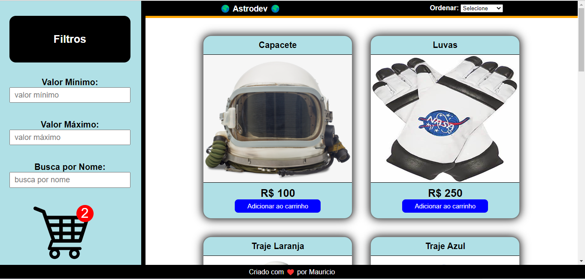

# Projeto-FrontEnd-REACT.JS   E-Commerce

E-commerce / astrounaltas 🚀

## Deploy (acesse o site)
https://mauricioleitesilva02.surge.sh/

## Stack utilizada :
* React.JS  
* Styled-components

## Funcionalidades

1- Home 

Lista todos os produtos da loja com seus respectivos nomes e preços. Possui um botão de adicionar ao carrinho.

2- Carrinho 

Mostra quantidade de produtos, o valor total da compra, podendo remover ou aumentar a quantidade de cada produto. Possui um botão de finalizar a compra.

3- Dados para compra  

Possui um formulário para os dados do cliente que irá receber o produto, e as opções de pagamentos no cartão de crédito e pix.

## Sobre mim 
Olá, me chamo Mauricio! sou apaixonado por Programação e Pentest 😍

## Links
linkedin : https://www.linkedin.com/in/maur%C3%ADcio-leite-silva-aa375b16a/  
github : https://github.com/maumau1998
